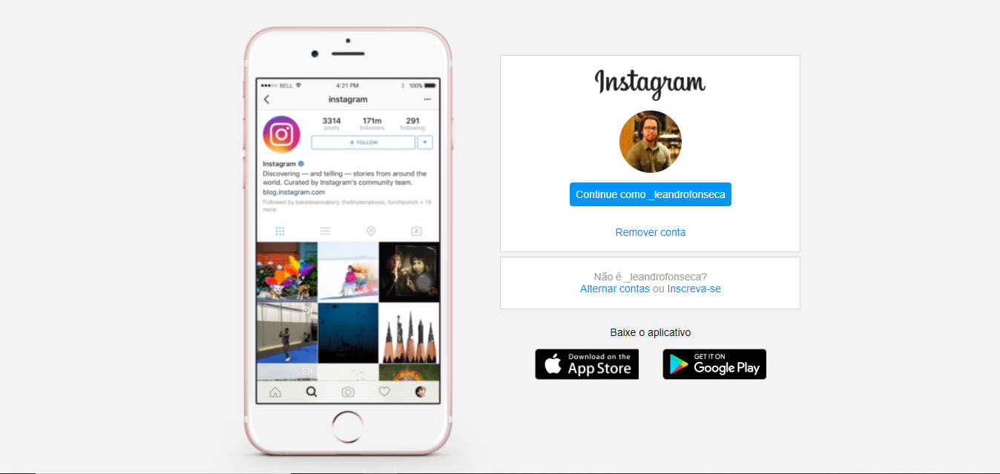

# Página inicial do Instagram

  

Projeto desenvolvido em uma das aulas do curso HTML Web Developer da Digital Innovation One. 

### Técnologias utilizadas:

* HTML 
* CSS

### O que foi aprendido:

Conceitos sobre CSS utilizando Flexbox e conceitos de responsividade.